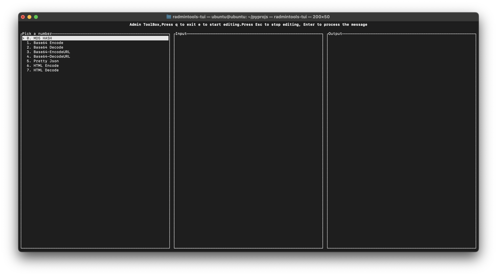
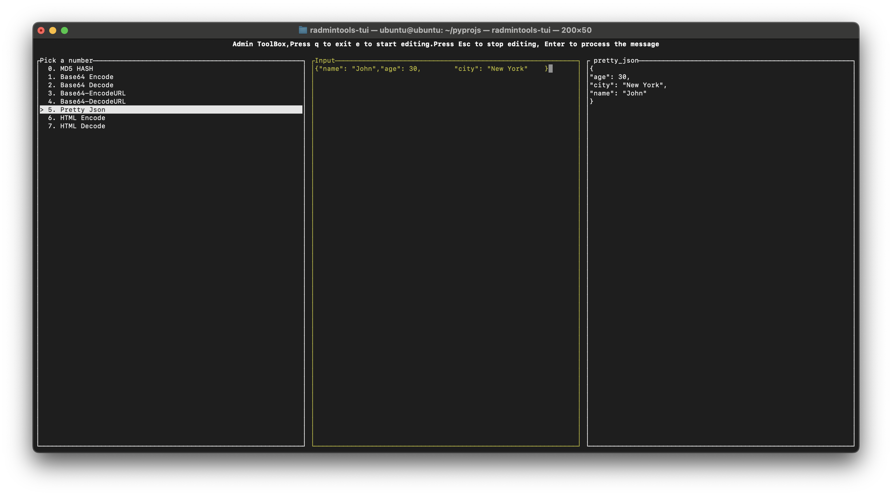
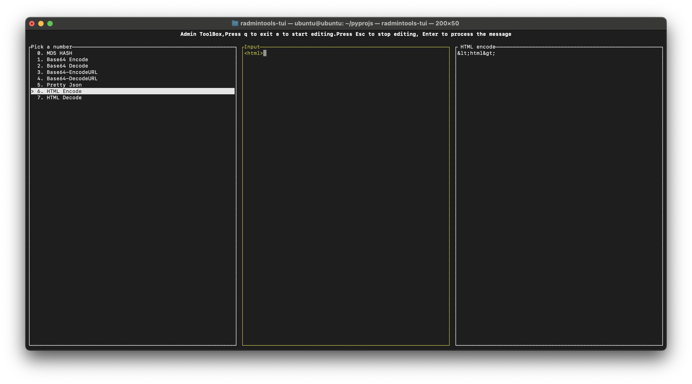
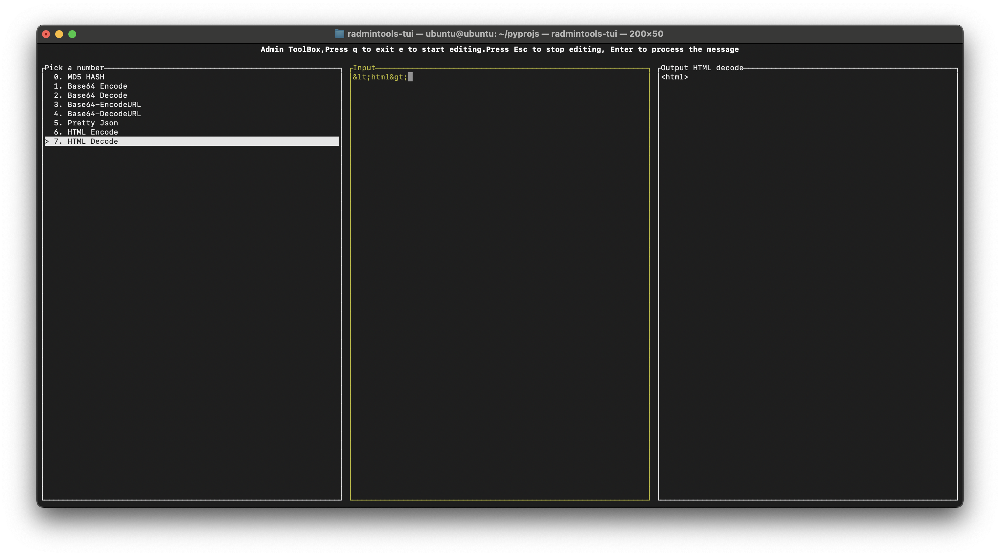
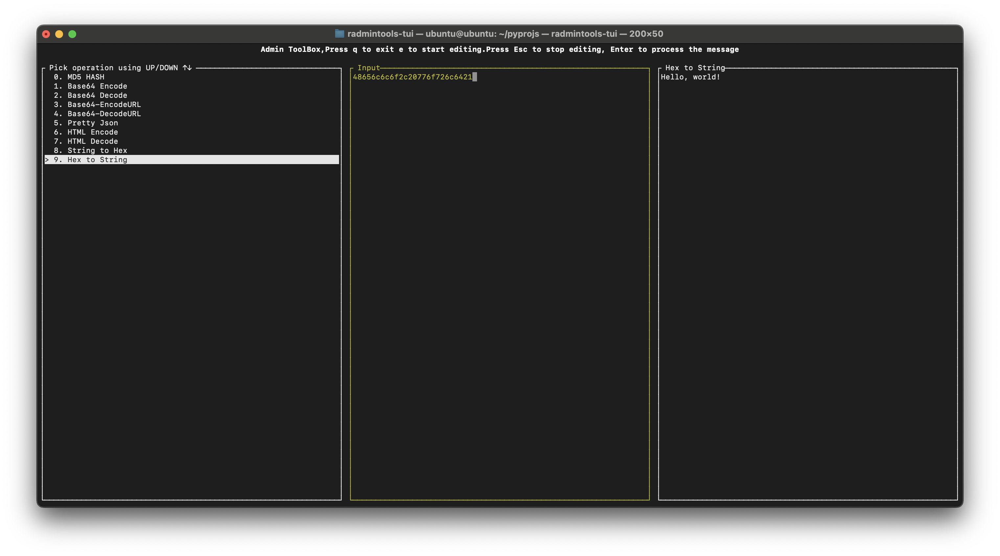
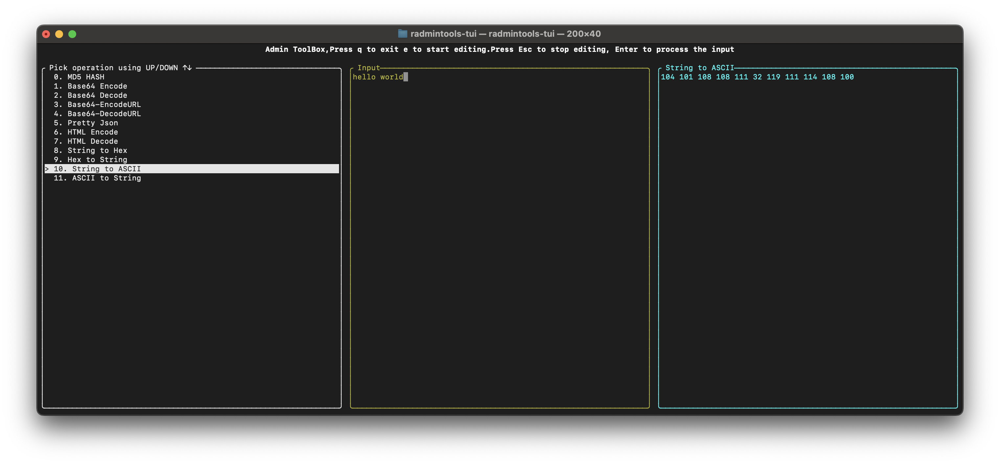
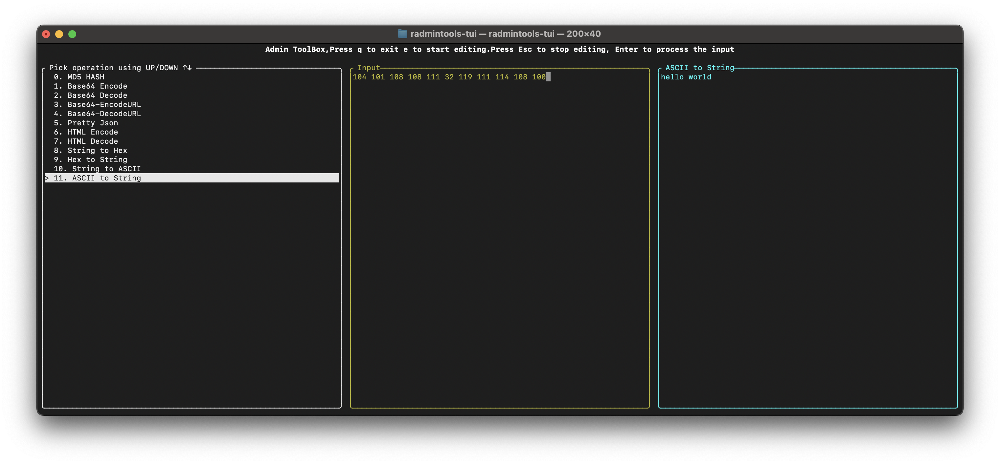

# RUST ADMIN TOOLS

A terminal user interfaces or common admin tools, with clipboard copy past support on terminal.

[](https://crates.io/crates/radmintools-tui)

## Installation
```
cargo install radmintools-tui
```
## Initial Screen


## MD5 Hash


## Pretty Json


## HTML Encode


## HTML Decode


## String to HEX


## HEX to String


## String to ASCII


## ASCII to String

### TODO
Encoding Decoding URL